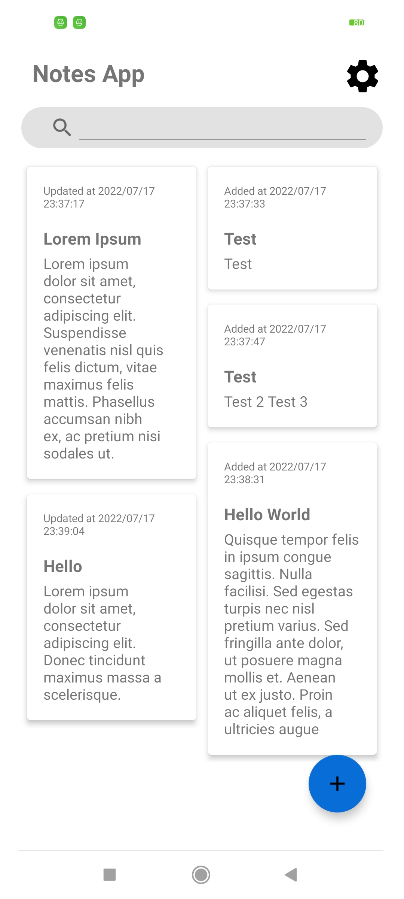
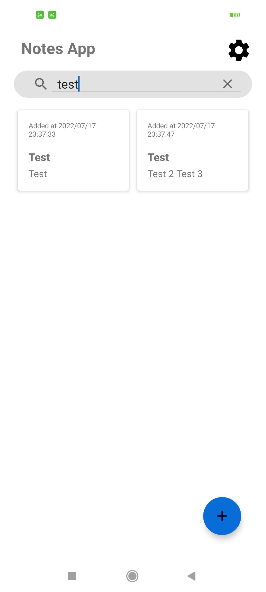
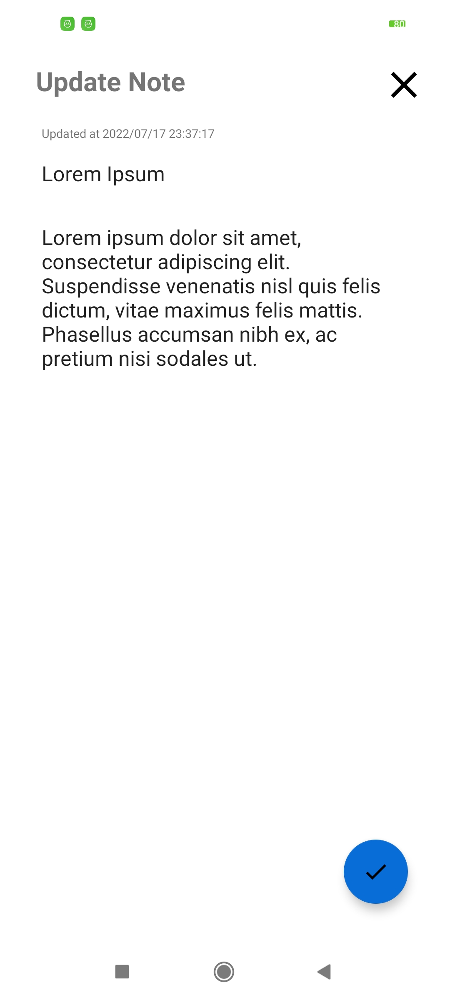
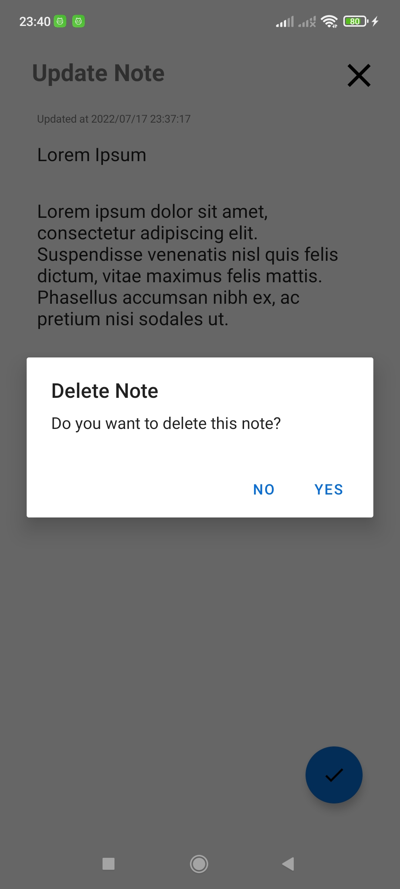
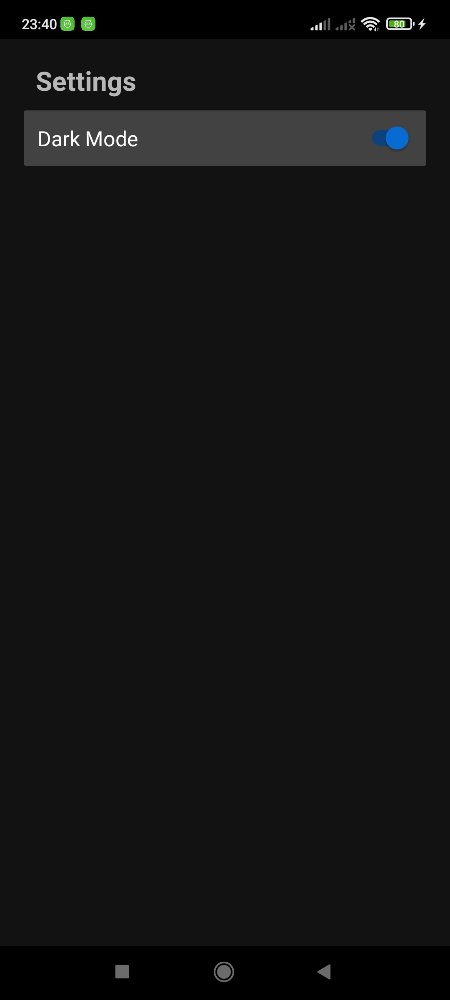
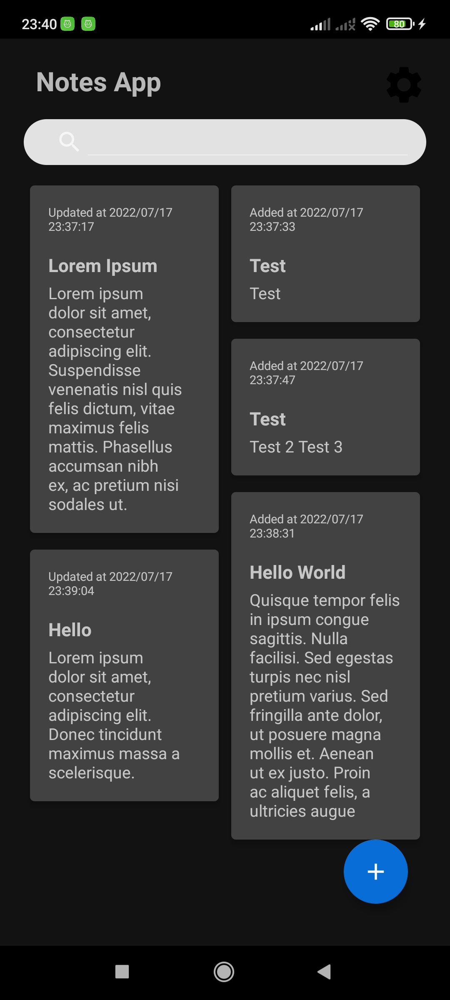

# Simple Notes App - Android

Simple Notes App built with Kotlin, developed using [Room](https://developer.android.com/jetpack/androidx/releases/room?hl=id) database.

## Features

- Implementing CRUD with [Room](https://developer.android.com/jetpack/androidx/releases/room?hl=id)
- Implementing MVVM Architecture
- Setting to change theme to Dark Mode
- Splash screen

## Sreenshots
|  |  |   |
| :---:                              | :---:                             | :---:                              |
|   |  |   |
|   |  |   |

## APK:

  [Debug apk](https://github.com/fakhrirasyids/NotesApp-Kotlin/blob/master/app-debug.apk)

## Todo
- Fix some layout problems
- Add testing
